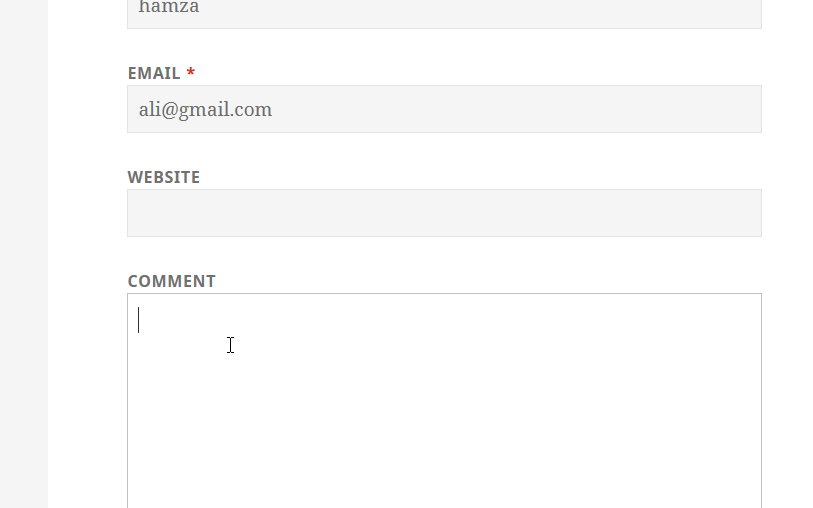
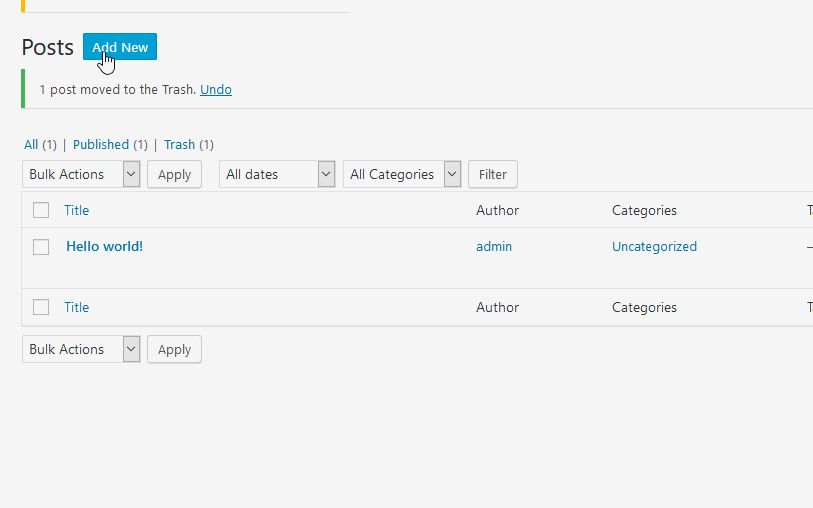
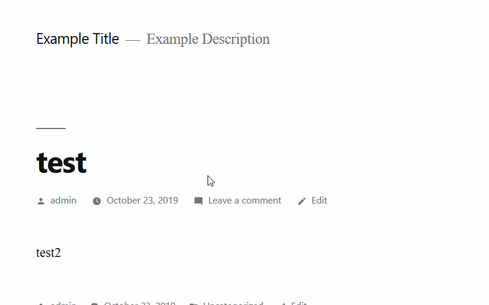
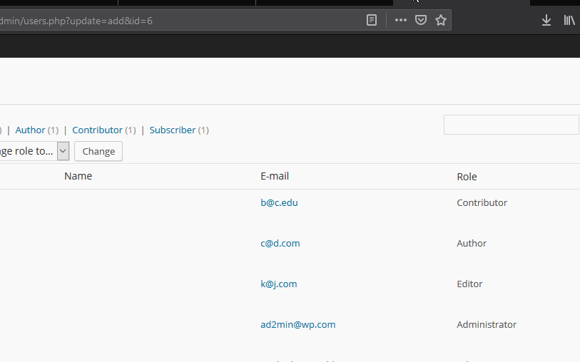
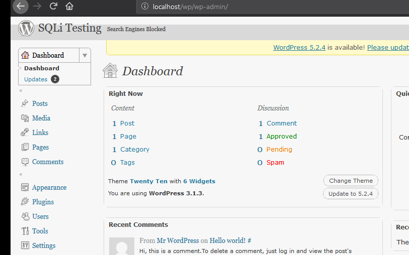

# Project 7 - WordPress Pentesting

Time spent: **36** hours spent in total

> Objective: Find, analyze, recreate, and document **five vulnerabilities** affecting an old version of WordPress

## Pentesting Report

1. (Required) WordPress 4.2 - Unauthenticated Stored Cross-Site Scripting (XSS)
  - [x] Summary: 
    - Vulnerability types: XSS
    - Tested in version: 4.2
    - Fixed in version: 4.2.1
  - [x] GIF Walkthrough: 
	

  - [x] Steps to recreate:  
	-Add a normal comment and wait for it to be approved.  
	-Once approved paste the payload in the reply to that comment.  
	-Wait for an admin to view that comment for the xss to do it's job.  
  - [x] Affected source code:
    - [Link](https://core.trac.wordpress.org/browser/tags/4.2/src/wp-comments-post.php)

2. (Required) WordPress 4.7.0-4.7.1 - Unauthenticated Page/Post Content Modification via REST API
  - [x] Summary: 
    - Vulnerability types: Privilege Escalation
    - Tested in version: 4.7
    - Fixed in version: 4.7.2
  - [x] GIF Walkthrough: 
	
  - [x] Steps to recreate:
	-Locate a website running wordpress 4.7
	-get and exploit from exploit db and run it against the website to see the posts
	-make a file with the desired content in it
	-run the exploit as shown in the gif to replace the content of the post with your content 
  - [x] Affected source code:
    - [Link 1](https://core.trac.wordpress.org/browser/tags/4.7/src/wp-includes/rest-api/endpoints/class-wp-rest-posts-controller.php)
  

3. (Required) WordPress 3.9-5.1 - Comment Cross-Site Scripting (XSS)
  - [x] Summary: 
    - Vulnerability types: CSRF + XSS + RCE
    - Tested in version: 5.1
    - Fixed in version: 5.1.1
  - [x] GIF Walkthrough: 
	
  - [x] Steps to recreate: 
	note the post id of the post you want to post the comment to
	create an html form just like the one shown in the gif
	send the link to the victim and wait for them to click on it
  - [x] Affected source code:
    - [Link 1](https://core.trac.wordpress.org/browser/tags/5.1/src/wp-includes/comment.php)

4. (Optional) Wordpress 4.0 User Enumeration
  - [x] Summary: 
    - Vulnerability types: User Enumeration 
    - Tested in version: 4.0 and 4.7
    - Fixed in version: not fixed
  - [x] GIF Walkthrough:
	 
  - [x] Steps to recreate: 
	in 4.0 just brute force author ids on the url http://host/?authod=ID where ID starts from 0 to as much as you want
	in 4.7 go to http://host/wp-json/wp/v2/users
  - [x] Affected source code:
    - [Link 1](https://core.trac.wordpress.org/browser/tags/4.7/src/wp-json/wp/v2/users)

5. (Optional) Wordpress 3.1.3 Blind SQLi
  - [x] Summary: 
    - Vulnerability types: Blind SQL injection
    - Tested in version: 3.1.3
    - Fixed in version: 3.1.4
  - [x] GIF Walkthrough: 
	
  - [x] Steps to recreate: 
	-any user with editor level access can modify the parameters in http://localhost/wp/wp-admin/edit-tags.php?taxonomy=link_category&orderby='or sleep(5)&order='or sleep(5)
  - [x] Affected source code:
    - [Link 1](https://core.trac.wordpress.org/browser/tags/3.1.3/src/wp-includes/taxonomy.php) 
    [Exploit Link] (https://www.exploit-db.com/exploits/17465)

## Assets

List any additional assets, such as scripts or files
- [Exploit Link for 2] (https://www.exploit-db.com/exploits/41223)
- [Form for 3] (https://ironhackers.es/en/tutoriales/wordpress-5-1-csrf-xss-rce-poc/)

## Resources

- [WordPress Source Browser](https://core.trac.wordpress.org/browser/)
- [WordPress Developer Reference](https://developer.wordpress.org/reference/)
- [Exploit-DB](https://www.exploit-db.com/)
- [Google](https://www.google.com/)
- [Summer of Pwnage](https://sumofpwn.nl/)
- [Sucuri](https://blog.sucuri.net/2017/02/content-injection-vulnerability-wordpress-rest-api.html)
- [Hacker Target](https://hackertarget.com/wordpress-user-enumeration/)

GIFs created with [LiceCap](http://www.cockos.com/licecap/).

## Notes

Describe any challenges encountered while doing the work

WPDistillery was very slow so changing versions required a lot of time.
- Some of the vulnerabilities were mislabeled in the wpscan results like vulnerability 3
- It was difficult to decide what exploits to actually try and were good enough for the assignment.
- WPDistillery didn't work with versions less then 3.7 so for the last vulnerability 
  I had to first make my own webserver with mysql and php but it turned out wordpress 3 wouldn't run in php7 
  so I had to download xampp stack from 2011 and run wordpress on it.

## License

    Copyright [2019] [Muhammad Hamza Ali]

    Licensed under the Apache License, Version 2.0 (the "License");
    you may not use this file except in compliance with the License.
    You may obtain a copy of the License at

        http://www.apache.org/licenses/LICENSE-2.0

    Unless required by applicable law or agreed to in writing, software
    distributed under the License is distributed on an "AS IS" BASIS,
    WITHOUT WARRANTIES OR CONDITIONS OF ANY KIND, either express or implied.
    See the License for the specific language governing permissions and
    limitations under the License.
